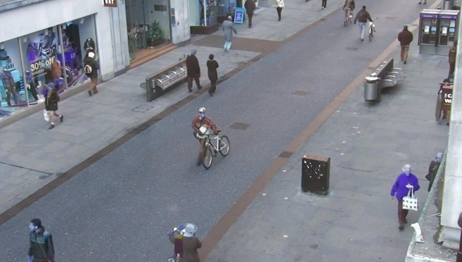
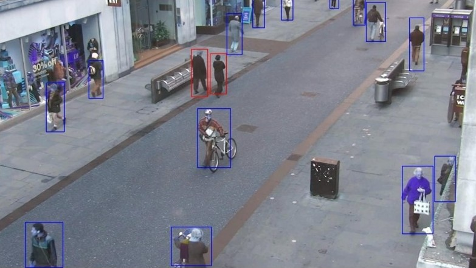

# Social Distancing Monitoring Tool


## Table of Contents
- Introduction
- How the App Works?
- Running the App locally
- Project Directory Tree
- Tools / Technologies Used
- To Do
- References / Useful resources
- Contributions / Bug
- Questions? Comments?

## Introduction

Coronavirus disease (COVID-19) is an infectious disease caused by a newly discovered coronavirus.
It is the most dealiest virus humanity has ever seen in recent times. It spreads from person to person through contact or if you're within close proximity of an infected person. 


It has so far infected millions of people and claimed over hundreds of thousands lives globally. Around 213 countries have been affected so far by this deadly virus.


In a fight against this virus, the only way to prevent the spread of COVID-19 is Social Distancing. Keeping a safe distance from each other is the ultimate way to prevent the spread of this disease (at least until a vaccine is found).


This project is an attempt to monitor if people are following social distancing norms or not.

This app can be used in 3 different modes:
- **Image**: Monitors social distancing norms on an still image.
- **Video**: Monitors social distancing norms on a video.
- **Real-time**: Monitors social distancing norms on a real-time video.

## How the App Works?

Given an input frame:



It produces the following output frame:




## Run the App locally
First, clone this project to your local machine:
```
git clone https://github.com/arya46/social-distancing.git

# change the working directory
cd social-distancing
```
Then install the required packages and libraries. Run the following command:
```
pip install -r requirements.txt
```
Before we can run the app, download the YOLO [weights](https://pjreddie.com/media/files/yolov3.weights) and [configs](https://raw.githubusercontent.com/pjreddie/darknet/master/cfg/yolov3.cfg") and place them in `model_data` folder.


Everything is set now. Use the following command to launch the app:
```
streamlit run app.py
```

## Project Directory Tree
```
├── model_data 
│   ├── yolov3.cfg.py   #expects YOLOv3 config here
│   └── yolov3.weights  #expects YOLOv3 weights here
├── static 
│   ├── instructions.md  
│   └── social_dist.jpg 
├── temp                #required for processing video 
├── utils 
│   ├── configs.py
│   ├── controllers.py
│   ├── helper_functions.py
│   └── yolov3.py
├── LICENSE
├── NOTICES
├── README.md
├── app.py
└── requirements.txt
```
## Tools / Technologies Used
- Streamlit
- YOLO v3
- OpenCV

## To Do
- [ ] Deployement on Heroku

## References / Useful resources
- https://github.com/streamlit/demo-self-driving/
- https://www.analyticsvidhya.com/blog/2020/05/social-distancing-detection-tool-deep-learning/
- https://pjreddie.com/darknet/yolo

## Contributions / Bug
If you want to contribute to this project, or want to report a bug, kindly open an issue [here](https://github.com/arya46/social-distancing/issues/new).

## Questions? Comments?

Reach me [here](https://arya46.github.io).

